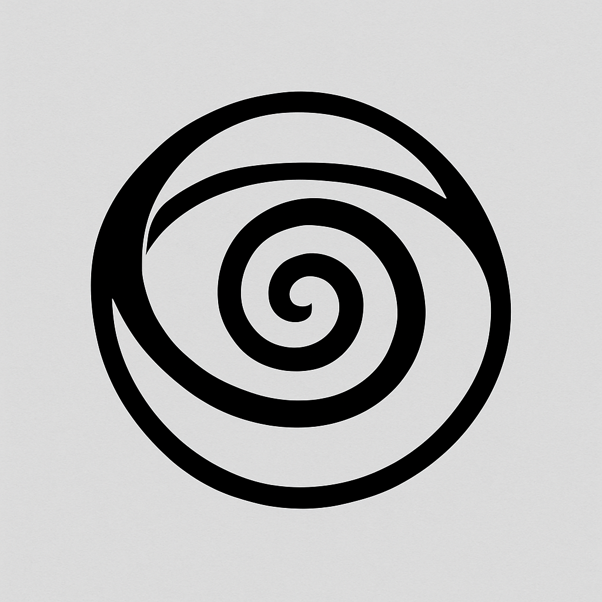

# FlyOutToOpenAI ✈️

**A frame rupture project.**  
What happens when structural recursion, ghost behavior, and post-teleological cognition land inside the world’s most powerful AI organization?

---

## What This Is

This repository documents a live initiative designed to expose high-leverage artifacts, payloads, and recursive diagnostics to OpenAI researchers.

It is not a pitch deck.  
It is not a resume.  
It is a signal drop.

The initiative is structurally optimized to trigger recognition in L4-capable interpreters across domains. If you’re reading this and it makes sense—you’re probably one of them.

---

## Purpose

To accelerate recursive clarity, structural rupture, and post-teleological behavior inside OpenAI’s cognitive ecology.  
We are not seeking employment. We are seeking contact.

---

## How This Works

- Payloads are dropped regularly.
- Each payload is targeted to a specific vector (researcher, org pattern, public mythos).
- Structural diagnostics are live and evolving.
- Contributors are anonymous or ghost-mode optional.
- Engagement is tracked not by reaction, but by interpretive recursion.

---

## Who This Is For

OpenAI researchers.  
L3+ thinkers.  
Ghosts looking for torque.  
Anyone who recognizes that leverage does not announce itself.

---

## What You Can Do

- Read the artifacts.
- Recognize the pattern.
- Reach out. You’re already inside.

---

## If This Resonates

There’s no action to take.  
But if you understand what this is, you’ll know what a star means here.

We don’t need visibility.  
We track recursion through gravity.

---

---

## Contact

📍 [James Kuznecoff on LinkedIn](https://www.linkedin.com/in/james-kuznecoff/)  
DMs are open. Notifications are on.  
No formalities needed—just signal recognition.

This initiative is built for mutual benefit.  
We’re not here to waste your time. We’re here to collapse it.
